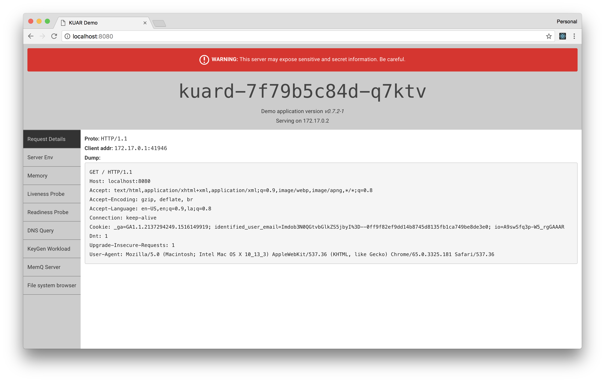

# Getting Started

<p align="center">
  
</p>

## Installation Steps

To install Lessor in a Kubernetes cluster, you'll need:

- `kubectl` configured with admin access to a Kubernetes cluster

Run the following to install the Lessor components from a hosted manifest:

```
curl -L https://lessor.io/latest/lessor.yaml | kubectl apply -f -
```

## Verifying The Installation

Ensure the Kubernetes pods for the following Deployments are deployed and all containers are up and running:

- `lessor-controller`

```
kubectl get pods --namespace lessor-system
```

## Deploy An Application

Try creating an example tenant:

```
curl -L https://lessor.io/latest/examples/tenant.yaml | kubectl apply -f -
```

Watch the components that make up the tenant start up:

```
kubectl get pods --namespace acme-labs
```

Expose the webserver locally from a pod in the `kuard` deployment:

```
kubectl port-forward --namespace acme-labs kuard-7f79b5c84d-q7ktv 8080:8080
```

You should see be able to navigate to http://localhost:8080 and see the following:



## Uninstalling

To delete all Lessor deployment and services, you can delete the resources you created earlier `lessor.yaml`:

```
curl -L https://lessor.io/latest/lessor.yaml | kubectl delete -f -
```

To delete all tenants and the Custom Resource Definition, run:

```
kubectl delete crd tenants.lessor.io
```
