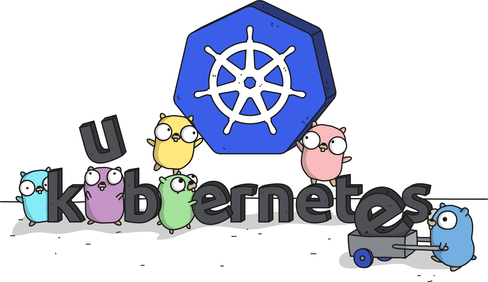

# Getting Started

<p align="center">
  
</p>

## Installation Steps

To install Lessor in a Kubernetes cluster, you'll need:

- `kubectl` configured with admin access to a Kubernetes cluster

Run the following from the root of the repository to install the latest Lessor components:

```
kubectl apply -f ./lessor.yaml
```

## Verifying The Installation

Verify that the `lessor-controller` deployment is running and healthy in `lessor-system`:

```
kubectl get pods --namespace lessor-system
```

## Uninstalling

To delete all Lessor deployment and services, you can delete the resources you created earlier `lessor.yaml`:

```
kubectl delete -f ./lessor.yaml
```
