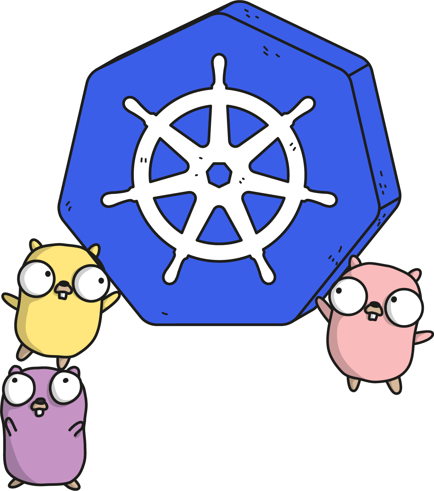

# Useful Learning Resources

  

### Helpful Blog Articles

- [CoreOS blog article introducing the operator pattern](https://coreos.com/blog/introducing-operators.html)
- [OpenShift blog article about using code generation with custom resources](https://blog.openshift.com/kubernetes-deep-dive-code-generation-customresources/)
- [Bitnami blog article about Controllers](https://engineering.bitnami.com/articles/a-deep-dive-into-kubernetes-controllers.html)

### Relevant Kubernetes Documentation

- [Kubernetes API Conventions](https://github.com/kubernetes/community/blob/master/contributors/devel/api-conventions.md)
- [Generating Clientset](https://github.com/kubernetes/community/blob/master/contributors/devel/generating-clientset.md)
- [Writing Controllers](https://github.com/kubernetes/community/blob/master/contributors/devel/controllers.md)

### Popular Open Source Operators

- [CoreOS's Etcd Operator](https://github.com/coreos/etcd-operator)
- [CoreOS's Prometheus Operator](https://github.com/coreos/prometheus-operator)
- [Kinvolk's Habitat Operator](https://github.com/kinvolk/habitat-operator)
